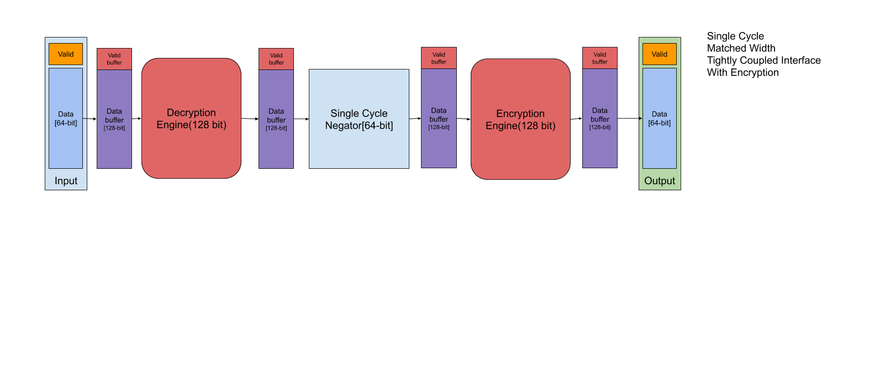
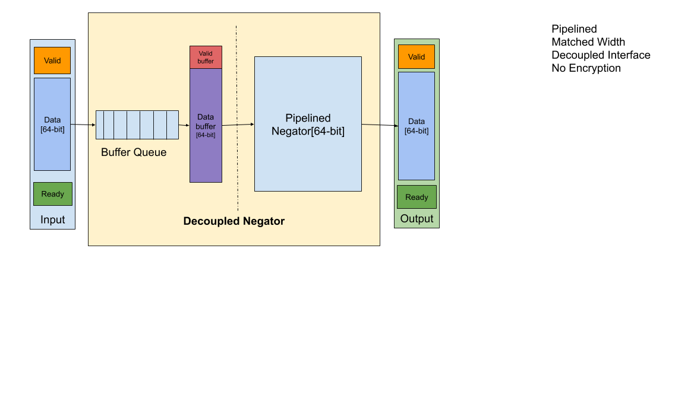

# A showcase for Verilog vs. Chisel vs. SimpleChisel

This showcase compares same designs in three different languages to demonstrate the value of [SimpleChisel](https://github.com/shibo-chen/simple-chisel-demo.git). 

In general, we implement a simple negator with three different negation components and interchange them in different 
configurations.We also have optional encryption stages. 
We want to show how easy it is to replace a component and change the pipeline (adding or deleting stages) in `SimpleChisel`,
comparing to other two languages.
## Menu

- [General Introduction](#general-introduction)
    - [Structure](#structure)
    - [Inteface](#interface)
    - [Basic Components](#basic-components)
- [Configurations](#configurations)
    - [Naming Convention](#naming-convention)
    - [Graphs](#graphs)
    - [Comparison Results](#comparison-results)
- [Try it out](#try-it-out)
    - [Run it](#run-it)
    - [Tests](#tests)

## General Introduction
All designs do the same thing: Negating signed integers to their 2's complement.

### Structure
Different designs in different languages are in different directories: Verilog, Chisel, or SimpleChisel. 

### Interface
All three designs have the same I/O interface. 

For `Verilog`, it takes a 64-bit data input and 1 bit for validity(`valid`). 
It outputs a 64-bit data and 1 bit for validity(`valid`).

For `Chisel` and `SimpleChisel`, it takes two ValidIO 64-bit data as inputs and outputs respectively.
### Basic Components
|Component name| Component Interface|Component Description|
|:-------------|:-------------------|:--------------------|
|SingleCycleNegator|Single Cycle, Tightly Coupled| Only combinational logic, finish in one cycle|
|PipelinedTightlyCoupledNegator|Three cycles, Tightly Coupled|Three stage pipeline. It buffers input value in the first  cycle. Negate it bitwise in the second cycle, and adds one to it in the third cycle|
|PipelinedDecoupledNagator|Three cycles, Tightly Coupled|Three stage pipeline, with a buffer prepends to the pipeline. It connects to other parts with ReadyIO|
|SimulatedAESDecryptEngin|128-bit block, fixed multiple cycle pipeline|A simulated decryption engine. Finishes in fixed number of cycles|
|SimulatedAESEncryptEngin|128-bit block, fixed multiple cycle pipeline|A simulated encryption engine. Finishes in fixed number of cycles|

## Configurations
For each of the three languages, we show 9 different configurations.

### Naming Convention
Each configuration is named as `Datapath_` followed by 4 letters that represnet its configuration.

`[S/P]` - `S` for single cycle, `P` for pipelined  
`[D/T]` = `T` for Tightly coupled, `D` for decoupled  
`[M/U]` = `M` stands for matched interface, meaning the intger is 64-bit, which
matches the width of datapath interface, `U` stands for unmatched interface, in which case, the integer
is of 32-bit, therefore each datapath input contains 2 integers.  
`[P/E]` = `P` stands for plaintext, meaning there is no encryption stages. 'E' stands for encrypted, 
meaning there are decryption engine at the beginning and decryption engine at the end
### Graphs
All graphs are under `Design-graphs`.

STMP:

STUP:

STME:

PTMP:

PTUP:

PTME:

PDMP:

PDUP:

PDME:

### Comparison Results

## Try it out

### Run it

### Tests

Export VERILATOR_INCLUDE={{{Verilator_install_path}/share/verilator/inlcude}